# Hi, I'm Dan! 👋

### Software Developer | Full-Stack Developer | Mobile Developer

I'm a Software Development Engineering student currently working as a **Software Developer at Global Safety Textiles**.

I enjoy building practical software, optimizing processes, and turning real-world problems into solutions that people actually use.

I'm especially interested in **Full-Stack Development, Mobile Development, AI integration, and building software that solves real problems.**

 

---

## 🚀 Tech Stack

### Languages

  

### Frameworks & Libraries

  

### Tools

  

---

## 💻 Featured Projects

### 🏢 HR Management System

Software system developed to modernize the company's HR processes.

The project replaced a decentralized certification system based on **paper documents and Excel files**, requiring a large-scale data migration and a new system architecture.

**Focus:** Internal Systems · Data Migration · Process Optimization

---

### 💳 Party Budget

Hackathon project focused on solving the problem of splitting expenses when traveling with friends.

Users can add their available credit-card budget and the system uses the accumulated amount to recommend travel options considering **accommodation, food, transportation and other expenses**.

**Focus:** AI · FinTech · Hackathon

---

### 🔐 Secure Voice Authentication

Cross-platform React Native application designed to simulate a high-risk financial transfer.

The application generates a verification word and initiates a phone call where the user must say the generated word. The system then analyzes the voice to help distinguish between real and synthetic/generated voices.

**Focus:** React Native · AI · Gemini · Voice Authentication

---

### 🌐 Personal Portfolio

My personal developer portfolio, designed and developed from scratch using **Astro.js**.

Built with a focus on performance, responsive design, clean architecture and presenting my experience and projects.

**Focus:** Astro · Web Development · UI/UX · Performance

---

## 📊 GitHub Stats

---

## 🔥 GitHub Streak

---

## 🌎 Connect With Me

---

## 🎧 Recently Played

---

---

### Thanks for visiting! 🚀

